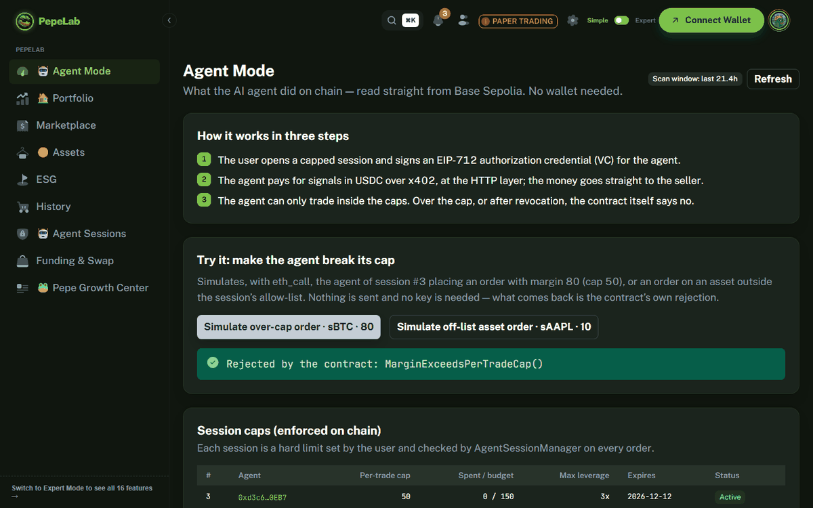

# PepeLab — bounded AI agents for on-chain derivatives

A user gives an AI agent a trading mandate — per-trade margin, total budget, max leverage, allowed assets, expiry. A contract on **Base** enforces that mandate on every order, and the agent pays for its market data per call over **x402**.

Entered in the Colosseum Crypto World's Fair (Base track). PepeLab started before the contest as our NCCU capstone; [the submission discloses the prior work](docs/SUBMISSION.md#12-development-history-and-disclosure) and lists what we built during the contest. **Submission write-up: [`docs/SUBMISSION.md`](docs/SUBMISSION.md)** · deployment log and decisions: [`HACKATHON.md`](HACKATHON.md) · latest demo run: [`demo/RUN.md`](demo/RUN.md).



## See it in 3 minutes

1. Open **https://zuemen.github.io/pepelab-colosseum/agent-mode**; no wallet is needed. It shows x402 payments, session caps and agent actions, read straight from Base Sepolia. The **Try it** button simulates the session's agent placing an over-cap or off-list order, and shows the contract's own revert.
2. Or read [`demo/SPEND_PERMISSIONS_RUN.md`](demo/SPEND_PERMISSIONS_RUN.md): a **Base Account** (Coinbase Smart Wallet) funds the agent through a **Base Spend Permission** (at most 100 mUSDC per day), opens the session in one batch, and signs the agent's credential (ERC-1271); a top-up over the daily allowance is mined and reverted by Coinbase's SpendPermissionManager.
   The same batch is one button on the app's **Sessions** page (EIP-5792 `wallet_sendCalls`); a browser test drives it on a Base Sepolia fork: [`demo/BASE_ACCOUNT_UI_E2E.md`](demo/BASE_ACCOUNT_UI_E2E.md).
3. Or read [`demo/RUN.md`](demo/RUN.md): eight steps with keys held by three separate parties (user, agent, signal seller), each on-chain step linked to BaseScan. The x402 payments are signed by the agent and submitted by the x402 facilitator. Two of the transactions are orders **mined and reverted** by the contract: one over the cap, one after revocation.

## How it works

| Piece | Role |
|---|---|
| `AgentSessionManager` | User-created session per agent: `maxMarginPerTrade`, cumulative `totalMarginBudget`, `maxLeverage`, `expiry`, asset allow-list, `revokeSession`. Checked on chain on every agent order. An agent can close only the positions its own session opened. |
| Authorization VC | W3C Verifiable Credential, signed with EIP-712 by the user (`did:pkh`), by an EOA or a Base Account (ERC-1271). The agent SDK verifies it and cross-checks every cap against the on-chain session before sending. |
| Base Spend Permissions (`SpendPermissionMarginFunder`) | A Base Account lets the agent top up its margin through Coinbase's SpendPermissionManager, at most a set amount per day. Set up from the Sessions page in one batch. |
| x402 signal API (`agent/signal-api`) | Pay-per-call endpoints in Circle USDC (EIP-3009). Signal fees can be routed on chain 70/20/10 (trader / platform / vault). |
| MCP server (`agent/mcp-server`) | Read tools, plus `open_position` / `close_position` through the session, for Claude-style agents. |
| `PerpetualExchange` | Perpetual CFDs: margin, OI-driven funding (8-hour interval, 0.75% cap), liquidation, insurance vault, ADL. |

## Deployed contracts (Base Sepolia, 84532)

Source of truth: `frontend/src/contracts/addresses.ts`. This is this repository's own deployment (2026-09-23); it shares no contract with the earlier `pepelab_onchain_cfd` deployment.

| Contract | Address |
|---|---|
| PerpetualExchange | [`0xC45dEd77F4A30658e3c52E6fB4809E502e3D3B0E`](https://base-sepolia.blockscout.com/address/0xC45dEd77F4A30658e3c52E6fB4809E502e3D3B0E?tab=contract) |
| AgentSessionManager | [`0x71125e25c903AD4e198e1863d5Bf26df97926CDe`](https://base-sepolia.blockscout.com/address/0x71125e25c903AD4e198e1863d5Bf26df97926CDe?tab=contract) |
| x402 FeeRouter (Circle USDC) | [`0xEeDcEE7cD62A644EA4Cf053f213d5D75dB0B49c6`](https://base-sepolia.blockscout.com/address/0xEeDcEE7cD62A644EA4Cf053f213d5D75dB0B49c6?tab=contract) |
| FeeRouter | [`0x91E4aC532201Fc67C715Aa202B6Fe85F51b34994`](https://base-sepolia.blockscout.com/address/0x91E4aC532201Fc67C715Aa202B6Fe85F51b34994?tab=contract) |
| InsuranceVault | [`0x42b9503E4AEf7A347DB75E54d32230720D1dd4f0`](https://base-sepolia.blockscout.com/address/0x42b9503E4AEf7A347DB75E54d32230720D1dd4f0?tab=contract) |
| MockOracle | [`0x7c7FD43376738151a09719Ab5B33962a77dfBb49`](https://base-sepolia.blockscout.com/address/0x7c7FD43376738151a09719Ab5B33962a77dfBb49?tab=contract) |
| MockUSDC (margin) | [`0x0910e965B06845BD3871860d522952a44a574058`](https://base-sepolia.blockscout.com/address/0x0910e965B06845BD3871860d522952a44a574058?tab=contract) |
| CopyTracker | [`0xF19E53dDBbD6CfDFb50deF952CA5f956ed08d0C4`](https://base-sepolia.blockscout.com/address/0xF19E53dDBbD6CfDFb50deF952CA5f956ed08d0C4?tab=contract) |
| StrategyRegistry | [`0x6Af6BEBC8fF0CE354e6E8A97921E1C5Ea95a7DE8`](https://base-sepolia.blockscout.com/address/0x6Af6BEBC8fF0CE354e6E8A97921E1C5Ea95a7DE8?tab=contract) |
| TraderStake | [`0x790fd51ad485013C5b87FD7765679461675A31FD`](https://base-sepolia.blockscout.com/address/0x790fd51ad485013C5b87FD7765679461675A31FD?tab=contract) |
| KYCRegistry | [`0x34D644b9d58c1D4B0Cb805BA49440F53Ca0378d0`](https://base-sepolia.blockscout.com/address/0x34D644b9d58c1D4B0Cb805BA49440F53Ca0378d0?tab=contract) |
| MockSwapRouter | [`0xCebdae595260F31541E44FBFfC80614d8B73C87a`](https://base-sepolia.blockscout.com/address/0xCebdae595260F31541E44FBFfC80614d8B73C87a?tab=contract) |
| SpendPermissionMarginFunder (Base Spend Permissions, 2026-09-24) | [`0x20277169a755C690b98F0894EF57AF835469C9Af`](https://base-sepolia.blockscout.com/address/0x20277169a755C690b98F0894EF57AF835469C9Af?tab=contract) |

Source code for all 16 contracts of the 2026-09-23 deployment (the table plus three oracle adapters and the x402 InsuranceVault) is verified on [Blockscout](https://base-sepolia.blockscout.com) and [Sourcify](https://sourcify.dev) as an exact match (creation and runtime bytecode), checked 2026-09-24. The SpendPermissionMarginFunder added on 2026-09-24 is an exact match on Sourcify. Click an address to read the code.

The exchange lets two contracts act for a user: the AgentSessionManager above (agents, within the session's limits) and the CopyTracker (copy trading, which each follower opts into). An agent's own key has no rights on the exchange.

## Quick start

```bash
# Contracts (Foundry)
cd contracts && forge build && forge test

# Agent stack
cd agent && npm ci && npm test
cp .env.example .env            # addresses already point at this deployment
npm run signal-api              # x402 API on http://localhost:4021
USER_PRIVATE_KEY=0x… AGENT_PRIVATE_KEY=0x… SELLER_PRIVATE_KEY=0x… \
  npx tsx examples/e2e-demo.ts  # replays the demo, rewrites demo/RUN.md

# Frontend (yarn only — package.json pins yarn@1.22.22 and uses "resolutions")
cd frontend && yarn install --frozen-lockfile
VITE_LOCALE=en yarn dev         # then open /agent-mode
```

Test keys need Base Sepolia ETH. The agent key also needs Circle test USDC (faucet.circle.com). Users get margin from `MockUSDC.faucet()`, which gives 1,000 mUSDC per address per 24 h.

## Repository layout

Documentation index, including which documents were inherited from the pre-contest capstone: [`docs/README.md`](docs/README.md).

| Path | Contents |
|---|---|
| `contracts/` | Solidity 0.8 + Foundry: exchange, session manager, fee routers, vaults, oracle adapters, tests |
| `agent/shared` | SDK: addresses, ABIs, session writes, VC issue/verify, audit trail |
| `agent/signal-api` | x402 paid API (Hono) and settlement worker |
| `agent/mcp-server` | MCP tools for agents |
| `agent/keeper` | Oracle price keeper (runs on GitHub Actions) |
| `agent/examples` | `e2e-demo.ts`, `x402-autonomous.ts`, `x402-loop.ts`, `buy-signal.ts` |
| `frontend/` | React 19 + Vite + MUI app; `/agent-mode` is the judge-facing page |

## Status and limitations

Every limit in `AgentSessionManager` is covered by invariant fuzzing (`contracts/test/AgentSessionInvariant.t.sol`): a handler mixes valid orders with orders over the cap or budget, above the leverage cap, on an off-list asset, after revocation or expiry, and from a non-agent. Removing any one of the seven checks makes an invariant fail (checked 2026-09-24).

This is a testnet prototype. Margin is MockUSDC. Prices come from a keeper-fed MockOracle; the keeper key can write any value. Pyth adapters are deployed, but the Pyth feed on Base Sepolia was stale when checked. The session budget is cumulative. The x402 payment and its 70/20/10 routing are two separate transactions. The full current-state and plan table is in [`docs/SUBMISSION.md`](docs/SUBMISSION.md#11-current-state-and-limitations).

Security history: [`docs/audit/AUDIT_2026-08-06.md`](docs/audit/AUDIT_2026-08-06.md). This deployment uses fresh keys. A historical key visible in the imported git history owns nothing here; do not use it.

## License

MIT for this project's code: see [`LICENSE`](LICENSE). Third-party components: see [`NOTICE`](NOTICE).

Parts of this project were built with AI coding assistants (Claude). All code is reviewed by the team.

Research prototype. No real assets. Not investment advice.
