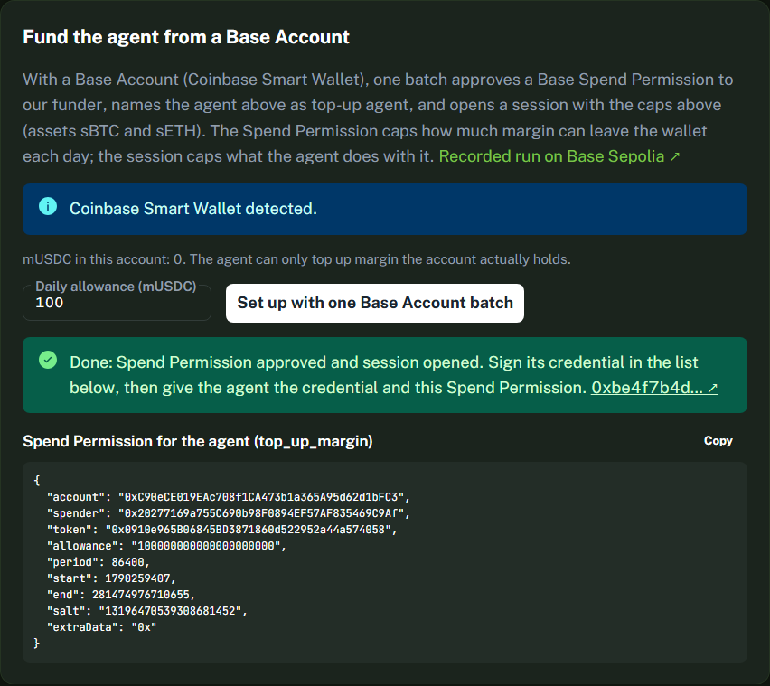

# Base Account card: browser E2E on a Base Sepolia fork

The Sessions page has a card, **Fund the agent from a Base Account**, that sets up a funded, bounded agent in one
EIP-5792 batch (`wallet_sendCalls`, `atomicRequired: true`):

1. `SpendPermissionManager.approve(permission)`: a Base Spend Permission for our funder, in mUSDC per day
2. `SpendPermissionMarginFunder.setTopUpAgent(agent)`
3. `AgentSessionManager.createSessionWithAssets(agent, caps…, [sBTC, sETH])`

It adds `addOwnerAddress(SpendPermissionManager)` first when the account does not list it as an owner yet. The session's
authorization credential is then signed from the session list. A Base Account returns an ERC-1271 signature.

The same three calls ran for real on Base Sepolia on 2026-09-24 (tx `0x7f6939cd…`, see
[SPEND_PERMISSIONS_RUN.md](SPEND_PERMISSIONS_RUN.md)). `frontend/src/lib/pepefi/baseAccountSetup.test.ts` pins the
calldata the card builds to that transaction, byte for byte.

This page covers the browser side. The deployed site was driven by Playwright against a local anvil fork of Base Sepolia,
with a mock wallet injected into the page.

## What was run

`demo/e2e/base_account_fork_e2e.py` runs the E2E. The site under test was <https://zuemen.github.io/pepelab-colosseum>, first at commit `7a10249` and again after the review fixes at `f57a933`, on 2026-09-24.

The mock EIP-1193 wallet behaves like a Coinbase Smart Wallet:

| Page asks for | Mock wallet does (on the fork) |
|---|---|
| `eth_*` | forwards to anvil |
| `wallet_sendCalls` | a throwaway owner key sends the smart wallet's `executeBatch(calls)` |
| `wallet_getCallsStatus` | returns the receipt in EIP-5792 2.0.0 shape |
| `eth_signTypedData_v4` | owner signs the wallet's `replaySafeHash(digest)`, wrapped as `SignatureWrapper(ownerIndex, sig)` |

The throwaway key only exists on the fork. The script never loads a real key, and nothing is sent to Base Sepolia.

| Scenario | Account | SpendPermissionManager already an owner? | Batch |
|---|---|---|---|
| `existing` | `0x56D83fEe…435F`, the Base Account from the recorded run | yes | 3 calls |
| `fresh` | a new Coinbase Smart Wallet (factory `0x0BA5ED0c…`), whose only owner is the throwaway key | no | 4 calls (adds it first) |
| `reject` | as `existing`, but the wallet declines `wallet_sendCalls` (EIP-1193 4001) | yes | none reaches the chain |

## Result: 20/20 checks in both setup scenarios

After the script got a retry for a header button that re-renders while the page loads, it ran four more times in a row
(two per scenario) and passed 20/20 each time. After the review fixes (`0cd77a4`) were deployed, all three scenarios
ran again: `existing` 20/20, `fresh` 20/20, `reject` 8/8.



| # | Check | existing | fresh |
|---|---|---|---|
| 1 | Fork setup: the throwaway key is an owner | ✅ | ✅ |
| 2 | Fork setup: SpendPermissionManager owner state as expected | ✅ yes | ✅ no |
| 3 | The card recognises the account (and says it will add SpendPermissionManager when needed) | ✅ | ✅ |
| 4 | The CTA is enabled once the agent address is filled | ✅ | ✅ |
| 5 | The batch confirms and the page shows **Done** with the tx link | ✅ | ✅ |
| 6 | The card reads the account again after the batch | ✅ | ✅ |
| 7 | `wallet_sendCalls` used EIP-5792 2.0.0 with `atomicRequired: true` | ✅ | ✅ |
| 8 | Batch length for the scenario (3 / 4) | ✅ | ✅ |
| 9 | Exactly one session opened | ✅ | ✅ |
| 10 | `session.user` is the Base Account | ✅ | ✅ |
| 11 | `session.agent` is the agent | ✅ | ✅ |
| 12 | `funder.topUpAgent(account)` is the agent | ✅ | ✅ |
| 13 | `SpendPermissionManager.isApproved(<the JSON the page shows>)` is true | ✅ | ✅ |
| 14 | SpendPermissionManager is an owner after the batch | ✅ | ✅ |
| 15 | **The agent tops up margin with that permission**: `funder.topUp` moves 5 mUSDC into the exchange margin | ✅ | ✅ |
| 16 | The new session appears in the list | ✅ | ✅ |
| 17 | No failed requests (other than GitHub Pages' deep-link fallback) | ✅ | ✅ |
| 18 | ERC-1271 `isValidSignature(digest, credential signature)` returns `0x1626ba7e` | ✅ | ✅ |
| 19 | No console errors on the page | ✅ | ✅ |
| 20 | **The agent's own verifier** (`verifyAuthorizationVCWithProvider`, via `agent/examples/verify-vc-file.ts`) accepts the credential | ✅ | ✅ |

An earlier run found one bug, fixed in `7a10249`. After the batch landed, the card still said it would add
SpendPermissionManager, and it still showed the old balance. Check 6 covers that now.

## Rejection: 8/8 checks

The first four checks are the same as rows 1–4 above. Then: the page says "You declined the request in your wallet. Nothing was
sent."; the wallet was asked exactly once; `nextSessionId` did not move; the button is usable again. Before `0cd77a4`
a rejection opened the wallet a second time. The page retried with the EIP-5792 1.0 request shape whenever an error
message contained "version", and every ethers v6 error message ends with `version=6.x`. `walletCalls.test.ts` now runs
wallet errors through a real ethers `BrowserProvider`.

## What this does not show

- **Not a real Base Account in a real browser.** The mock produces the same calls and the same signature format as a
  Coinbase Smart Wallet, but the Base Account popup and its SDK were not in the loop.
- **An account that is not deployed yet** (the card's "will be created by this batch" state) was not exercised. That
  path relies on the wallet deploying the account with SpendPermissionManager as an owner. After the batch the card
  reads the account again, so if the owner is missing the card says so.
- The fork is local. The only on-chain run of this batch is the scripted one in
  [SPEND_PERMISSIONS_RUN.md](SPEND_PERMISSIONS_RUN.md).

## Run it

```bash
anvil --fork-url https://base-sepolia-rpc.publicnode.com --chain-id 84532 --block-time 1
pip install playwright eth-account && python -m playwright install chromium
(cd agent && npm ci)
python demo/e2e/base_account_fork_e2e.py existing     # or: fresh, reject
```

Screenshots, the permission JSON, the credential and `result.json` are written to `demo/e2e/out/<scenario>/` (ignored by git).
