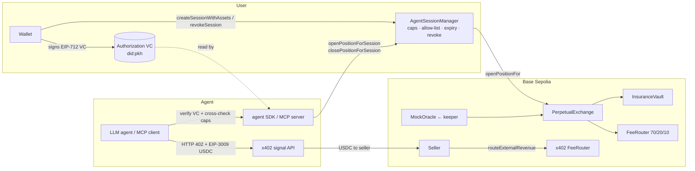

# PepeLab — bounded AI agents for on-chain derivatives

**One line:** a user gives an AI agent a trading mandate — per-trade margin, total budget, max leverage, allowed assets, expiry — and a contract on Base enforces it on every order, while the agent pays for its market data per call over x402.

Colosseum Crypto World's Fair · Base track · repo `zuemen/pepelab-colosseum` · all contracts on **Base Sepolia (84532)**.

---

## 1. Problem

Agents can already sign trades. What they cannot get is a **bounded** mandate for derivatives:

- **Wallet-level permissions don't understand trades.** Coinbase Spend Permissions cap how much of one token a spender can pull per period ([docs](https://docs.cdp.coinbase.com/wallets/using-wallets/spend-permissions), read 2026-09-23). The CDP policy engine checks value, target, calldata, network and net USD change at signing time ([docs](https://docs.cdp.coinbase.com/server-wallets/v2/using-the-wallet-api/policies/overview)). Neither knows leverage, margin versus notional, which asset is traded, or cumulative exposure.
- **Venue-level agent keys are all-or-nothing.** Hyperliquid API wallets can place and cancel orders but not withdraw; the docs describe no per-agent size, leverage or asset limits ([docs](https://hyperliquid.gitbook.io/hyperliquid-docs/for-developers/api/nonces-and-api-wallets), read 2026-09-23). GMX One-Click Trading limits a subaccount by action count and expiry only ([docs](https://docs.gmx.io/docs/trading/v2/)).
- **Human-in-the-loop defeats autonomy.** In the Base MCP integration of Avantis, every action needs the user's sign-off in the Base App ([Crypto Briefing, 2026-06-09](https://cryptobriefing.com/avantis-base-mcp-ai-perpetual-trading/)).
- **Agents have no native way to buy the data they trade on**, and no auditable record tying a trade to who authorized it.

## 2. Solution

Three pieces, each usable on its own:

| Piece | What it does | Where |
|---|---|---|
| **AgentSessionManager** | The user opens a session for one agent address: `maxMarginPerTrade`, `totalMarginBudget` (cumulative), `maxLeverage`, `expiry`, and an asset allow-list. Every `openPositionForSession` is checked on chain; `revokeSession` stops the agent at once. The agent can only close positions its own session opened. | `contracts/src/AgentSessionManager.sol` |
| **Authorization VC** | The user signs a W3C Verifiable Credential (EIP-712, `did:pkh`) naming the agent, session and caps. The agent SDK verifies the signature **and** cross-checks every cap against the on-chain session before sending, so the off-chain credential and the on-chain mandate cannot drift. | `frontend/src/contracts/agentAuth.ts`, `agent/shared/src/identity.ts` |
| **x402 signal API** | Pay-per-call HTTP endpoints (`/oracle/:asset` 0.005 USDC, `/signals/:trader` 0.01 USDC). The agent gets HTTP 402, signs an EIP-3009 Circle USDC authorization, and retries. Signal fees can be routed on chain 70/20/10 (trader / platform / vault) through a FeeRouter. | `agent/signal-api` |

Agents drive all of it through an **MCP server** (`agent/mcp-server`: read tools plus `open_position` / `close_position` through the session) or the TypeScript SDK (`agent/shared`).

## 3. Proof: the replayable demo

`agent/examples/e2e-demo.ts` runs the whole story with **three separate keys** (User, Agent, Seller): eight steps and ten on-chain transactions. Latest run: [`demo/RUN.md`](../demo/RUN.md). Every on-chain step links to BaseScan; step ② is an off-chain signature.

| # | Actor | Step | On chain |
|---|---|---|---|
| ① | User | deposit margin, open session: 50 mUSDC per trade, 150 budget, 3x, sBTC/sETH, 7 days | tx |
| ② | User | sign the EIP-712 authorization VC | off-chain |
| ③ | Agent | buy market data and a trader's signal over x402 → Circle USDC to the seller | 2 txs |
| ③c | Seller | route the 0.01 USDC signal fee 70/20/10 → the trader accrues 0.007 USDC | tx |
| ④ | Agent | open sBTC long, 20 margin, 2x, through the session | tx |
| ⑤ | Agent | try 80 margin (cap 50) → **mined and reverted: `MarginExceedsPerTradeCap`** | tx (status 0) |
| ⑥ | Agent | close through the session | tx |
| ⑦ | User | revoke | tx |
| ⑧ | Agent | try again inside the caps → **mined and reverted: `SessionIsRevoked`** | tx (status 0) |

Steps ⑤ and ⑧ are sent with an explicit gas limit on purpose: the SDK would refuse them locally, which proves nothing. Forcing them on chain shows the **contract** is the enforcement point.

**Agent Mode page (`/agent-mode`)** — for judges, no wallet needed. It reads x402 payments, session caps and agent actions straight from chain, replays the recorded run with its rejected transactions, and has a **"try it" button** that simulates an over-cap or off-list order from a live session's agent with `eth_call`. What you see is the contract's own revert (`MarginExceedsPerTradeCap`, `AssetNotAllowed`).

## 4. Architecture



## 5. Base integration

**Shipped (verifiable on Base Sepolia):**

- Every contract is deployed on Base Sepolia. The exchange authorizes exactly one agent contract, the AgentSessionManager.
- x402 payments settle in **Circle's official Base Sepolia USDC** (`0x036CbD53…CF7e`, EIP-3009 `transferWithAuthorization`) through the x402 facilitator. Each payment is an on-chain USDC transfer from agent to seller.
- Signal revenue is split on chain by a FeeRouter bound to that same USDC (`routeExternalRevenue`).
- The price keeper runs on GitHub Actions against this deployment. Oracle adapters for Pyth and Chainlink on Base Sepolia are deployed (see limitations).

**Planned (not in this submission):**

- Pair the session with **Base Account Spend Permissions**. Spend Permissions bound the USDC the agent can move per period; the session bounds what it can do with it (leverage, assets, per-trade size). The two are complementary.
- List the signal API in **x402 Bazaar**, the CDP facilitator's service catalog ([docs](https://docs.cdp.coinbase.com/x402/bazaar)).
- **Paymaster**-sponsored session creation, so a user needs no ETH to delegate.
- A small Base mainnet deployment of the x402 layer only (risk review first; see Roadmap).

## 6. Contract addresses (Base Sepolia)

Source of truth: `frontend/src/contracts/addresses.ts`. Deployment details and on-chain checks: [`HACKATHON.md`](../HACKATHON.md).

| Contract | Address |
|---|---|
| PerpetualExchange | `0xC45dEd77F4A30658e3c52E6fB4809E502e3D3B0E` |
| AgentSessionManager | `0x71125e25c903AD4e198e1863d5Bf26df97926CDe` |
| x402 FeeRouter (Circle USDC) | `0xEeDcEE7cD62A644EA4Cf053f213d5D75dB0B49c6` |
| FeeRouter (perp fees) | `0x91E4aC532201Fc67C715Aa202B6Fe85F51b34994` |
| InsuranceVault | `0x42b9503E4AEf7A347DB75E54d32230720D1dd4f0` |
| MockOracle | `0x7c7FD43376738151a09719Ab5B33962a77dfBb49` |
| MockUSDC (margin) | `0x0910e965B06845BD3871860d522952a44a574058` |
| CopyTracker | `0xF19E53dDBbD6CfDFb50deF952CA5f956ed08d0C4` |
| StrategyRegistry | `0x6Af6BEBC8fF0CE354e6E8A97921E1C5Ea95a7DE8` |
| KYCRegistry | `0x34D644b9d58c1D4B0Cb805BA49440F53Ca0378d0` |
| TraderStake | `0x790fd51ad485013C5b87FD7765679461675A31FD` |
| MockSwapRouter | `0xCebdae595260F31541E44FBFfC80614d8B73C87a` |

Judge sandbox: session **#3** (agent `0xd3c6a11e…0EB7`, 50 per trade, 150 budget, 3x, sBTC/sETH; created 2026-09-23, tx `0xc3d6d00f…4336`) stays active until 2026-12-12. The Agent Mode "try it" button uses the newest active session, which is #3 unless a newer one is opened.

## 7. Run it locally

```bash
# contracts
cd contracts && forge test            # 776 tests

# agent: signal API, then the three-party demo
cd agent && npm ci
cp .env.example .env                   # addresses already point at this deployment
npm run signal-api                     # http://localhost:4021
USER_PRIVATE_KEY=0x… AGENT_PRIVATE_KEY=0x… SELLER_PRIVATE_KEY=0x… \
  npx tsx examples/e2e-demo.ts         # writes demo/RUN.md

# frontend
cd frontend && yarn install --frozen-lockfile
VITE_LOCALE=en yarn dev                # open /agent-mode
```

Test keys need Base Sepolia ETH. The agent key also needs Circle test USDC from faucet.circle.com. The user gets margin from `MockUSDC.faucet()`.

## 8. Business model

| Revenue line | Mechanism | Already on chain? |
|---|---|---|
| Signal and data fees | Agents pay per call over x402. Strategy providers set a price and keep 70%; 20% platform; 10% insurance vault | Yes: `routeExternalRevenue` |
| Trading fees | Perp trading and performance fees route through the FeeRouter's existing 70/20/10 split | Yes: FeeRouter |
| Mandate infrastructure (B2B) | Agent builders and wallets license the session and VC layer to offer "bounded autonomy" on their own venue | Roadmap |

**Who pays**

- **Agent developers** want to ship a trading agent their users can safely fund.
- **Quant and strategy providers** want to sell signals to machines, with on-chain proof of performance and automatic revenue share.
- **Retail users** want to delegate without handing over a key.

**Why x402 plus a VC mandate is the wedge**

x402 turns data into something an agent can buy without accounts or API keys. The mandate turns "the agent may trade" into a precise, revocable, auditable contract. Every order can be traced to a user signature (the VC), an on-chain session, and the paid inputs the agent used. Hyperliquid, GMX and Spend Permissions each cover a part of this; none enforces trade-level limits on chain.

**Market context** (third-party, dated):

- On-chain perp DEX volume was $593.3B over 30 days (DefiLlama via [CoinLaw, 2026-09-09](https://coinlaw.io/perpetual-futures-statistics/)).
- Hyperliquid alone did $239.2B over 30 days ([The Crypto Times, 2026-09-17](https://www.cryptotimes.io/2026/09/17/hyperliquid-leads-30-day-perpetual-volume-with-nearly-240b/)).
- Perp volume on Base was $3.1B over 30 days (DefiLlama via The Crypto Times, 2026-09-17; a different window from the CoinLaw figure). That is a small base with room to grow for agent-driven flow.
- x402 is an open standard governed by the x402 Foundation under the Linux Foundation since 2026-07-14 ([LF](https://www.linuxfoundation.org/press/linux-foundation-announces-operational-launch-of-x402-foundation-to-standardize-internet-native-payments-for-ai-agents-and-applications)). Artemis estimates that most of its current traffic is protocol signaling rather than commerce ([Forkast, 2026-08-04](https://finance.yahoo.com/markets/crypto/articles/x402-foundation-activated-27-old-152440828.html)). Paid machine-to-machine data is early; that is the opportunity, not a claim of traction.

## 9. Competitive landscape

| | Per-trade size cap | Leverage cap | Asset allow-list | Revocable | Agent pays for data | Enforced where |
|---|---|---|---|---|---|---|
| Hyperliquid API wallet | — | — | — | deregister | — | venue (key scope only) |
| GMX One-Click Trading | — | — | — | expiry / action count | — | venue |
| Base Spend Permissions | token allowance per period | — | — | yes | — | wallet |
| Avantis via Base MCP | user signs each action | — | — | n/a | — | human |
| **PepeLab session + VC** | **yes** | **yes** | **yes** | **yes** | **x402** | **contract** |

Sources: see §1 (read 2026-09-23). A dash means the source documents no such control.

## 10. Roadmap

1. **Venue-agnostic mandates.** Move the session checks into a guard any perp venue on Base can call before `openPositionFor`. Our exchange becomes the reference venue.
2. **Base-native stack.** Spend Permissions for the cash leg; Paymaster-sponsored delegation; x402 Bazaar listing; an ERC-8004 identity entry for each agent (the standard is still a Draft: [EIP-8004](https://eips.ethereum.org/EIPS/eip-8004)).
3. **Net-exposure budgets.** Today `totalMarginBudget` is cumulative: closing does not refund budget. That is conservative by design. Add an optional net-exposure mode.
4. **Decentralized pricing.** The oracle adapters are deployed. Pyth on Base Sepolia is pull-based and was stale when we checked, so the next step is to push Hermes price updates from the keeper before relying on it.
5. **Institutional agents (vLEI).** A fund or corporate treasury should be able to prove which regulated legal entity authorized an agent, and which officer signed. GLEIF's vLEI carries exactly that: a Legal Entity credential plus an Official Organizational Role (OOR) credential for the signer ([GLEIF](https://www.gleif.org/en/organizational-identity/lei-vlei/the-verifiable-lei-vlei)). Our authorization VC would add an OOR-backed issuer, and `KYCRegistry` would accept vLEI-verified entities. That opens RWA and institutional flow, where "who authorized this agent" is a compliance requirement rather than a nice-to-have. GLEIF has published work on agent delegation ([blog, 2026-08-25](https://www.gleif.org/en/newsroom/blog/why-ai-agents-need-verifiable-organizational-identity)). This is a roadmap item, not part of this submission.

## 11. Current state and limitations

| Area | Today | Plan |
|---|---|---|
| Network | Base Sepolia only; margin token is MockUSDC | Mainnet for the x402 layer first, after a risk review |
| Prices | MockOracle fed by a keeper (CoinGecko / Yahoo). The keeper key can write any value. Pyth relay deployed but stale on testnet | Pyth Hermes push, then the aggregator as primary |
| Budget semantics | Cumulative spend; closing does not refund budget | Optional net-exposure mode |
| Revenue routing | The x402 payment and the 70/20/10 routing are two transactions; routing is done by the seller | Atomic routing at the payee |
| VC | Standing authorization without a nonce. Revocation is the on-chain `revokeSession` | Status list and nonce |
| Liquidation | The remaining collateral goes to the liquidator and the vault, not back to the owner | Refund the remainder |

Security history: [`docs/audit/AUDIT_2026-08-06.md`](audit/AUDIT_2026-08-06.md). This deployment uses fresh keys; a historical key visible in git history owns nothing here.

## 12. Team

<!-- TODO(user): names, roles, one line each on background. University: NCCU (University Award). -->

## AI usage

Parts of this project were built with AI coding assistants (Claude). All code is reviewed by the team.
